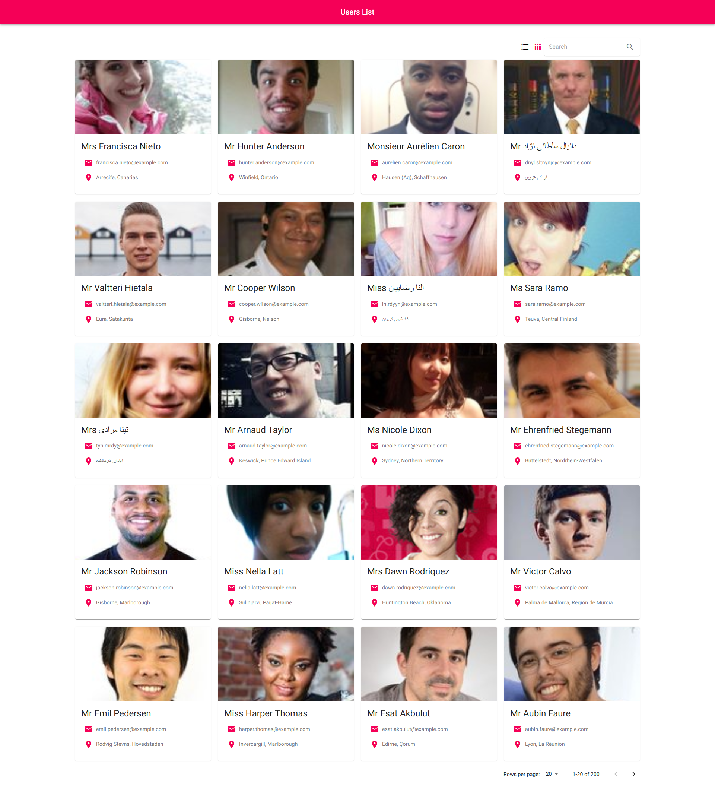
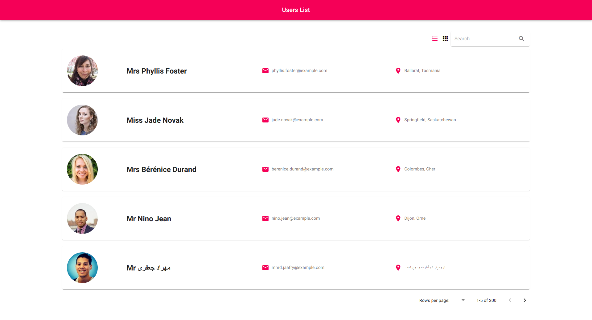
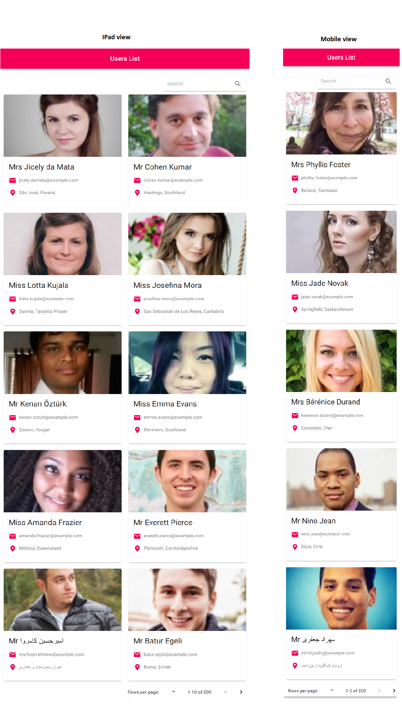

# ReactJS Demo Application
### This application has follwing features:
- User list with the ability to switch view between Grid and List in Desktop
- Search users
- Pagination with the ability to change records per page
- Resposive design - Desktop, tablet, mobile friendly

### Steps to follow to run and build the application:

###### To install dependent packages in project directory
##### `npm install`
#
###### To run application, in localhost the application will run on [http://localhost:3000](http://localhost:3000)
##### `npm start`
#
###### To create build of application for production, build will be created in /build folder.

##### `npm run build`
#
###### To run unit test

##### `npm test`
- I have written test case to take snapshot of component, but currently it is taking snapshot of loader screen, we can overcome this issue by using redux mockstore. As it was little bit time consuming, I did not complete it as of now.

### Application Snapshots

