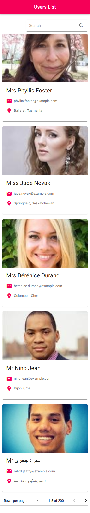

#ReactDemo

## Available Scripts

To install dependent packages in project directory

### `npm install`

To run application, in localhost the application will run on [http://localhost:3000](http://localhost:3000)

### `npm start`

To create build of application for production, build will be created in /build folder.

### `npm run build`

To run unit test
- I have written test case to take snapshot of component, but currently it is taking snapshot of loader screen, we can overcome this issue by using redux mockstore. As it was little bit time consuming I am not able to complete it as of now.

### `npm test`

## This demo application have follwing features

- Users list with grid and list layout
- Search users
- Pagination
- Resposive design - Desktop, mobile, tablet friendly

### Application Snapshot

### Application Snapshots

